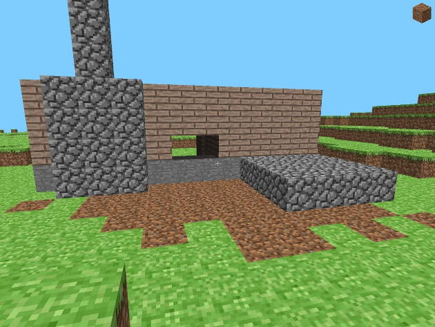

# rd-20090515 (Pre-Classic)
Development day: May 15, 2009

 
"The back of a house I built!" ~[The Word of Notch](https://notch.tumblr.com/post/108350782/the-back-of-a-house-i-built-a-new-video-is)

## Changes
- General
    - Game tick is now 20 ticks per second
    - Fullscreen mode
    - Custom textures for each face of a tile
    - Added stone, dirt and wood tile
- Entity
    - Reduced zombie spawn amount to 10
    - Zombies who fall below y level -100 are now removed from the world
    - Modified physics of entities
    - Zombies now appear darker in the shadow
- World
    - Implemented perlin noise world generation
    - Grass can grow on dirt tiles in sunlight
- Controls
    - Added hotkey "G" to spawn zombies
    - Block picking using the number keys 1-4
- HUD
    - Crosshair
    - Picked tile in the top right corner

## References
- [Minecraft Wiki - Java_Edition_pre-Classic_rd-20090515](https://minecraft.gamepedia.com/Java_Edition_pre-Classic_rd-20090515)
- [The Word of Notch - The back of a house I built!](https://notch.tumblr.com/post/108350782/the-back-of-a-house-i-built-a-new-video-is)
- [YouTube - Minecraft progress.](https://www.youtube.com/watch?v=59xZ5VFo0sA)

## Setup
1. Clone the project
2. Set the VM option ``-Dorg.lwjgl.librarypath="<path_to_project>/run/natives"``
3. Set the working directory to ``./run``