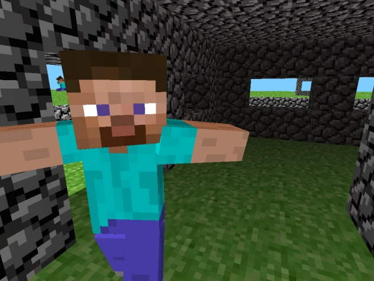

# rd-132328 (Pre-Classic)
Development phase: May 13, 2009 (22:11 - 23:28 UTC+2)

 
"A simple house and a very very silly mob." ~[The Word of Notch](https://notch.tumblr.com/post/107394370/a-simple-house-and-a-very-very-silly-mob)

## Changes
- Moved physics handling to a parent class called "Entity"
- Added cube renderer
- Added human character model

## References
- [Minecraft Wiki - Java_Edition_pre-Classic_rd-132328](https://minecraft.gamepedia.com/Java_Edition_pre-Classic_rd-132328)
- [The Word of Notch - Exhausted, but happy](https://notch.tumblr.com/post/107611170/exhausted-but-happy)

## Setup
1. Clone the project
2. Set the VM option ``-Dorg.lwjgl.librarypath="<path_to_project>/run/natives"``
3. Set the working directory to ``./run``