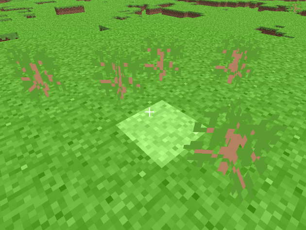

# rd-161348 (Pre-Classic)
Development phase: May 16, 2009 (until 13:48 UTC+2)

 
A few bushes placed in the recreation

## Changes
- Added bush tile
- Changed HUD scale
- Flipped tile preview
- Rotate particles to the y camera position

## References
- [Minecraft Wiki - Java_Edition_pre-Classic_rd-161348](https://minecraft.gamepedia.com/Java_Edition_pre-Classic_rd-161348)

## Setup
1. Clone the project
2. Set the VM option ``-Dorg.lwjgl.librarypath="<path_to_project>/run/natives"``
3. Set the working directory to ``./run``